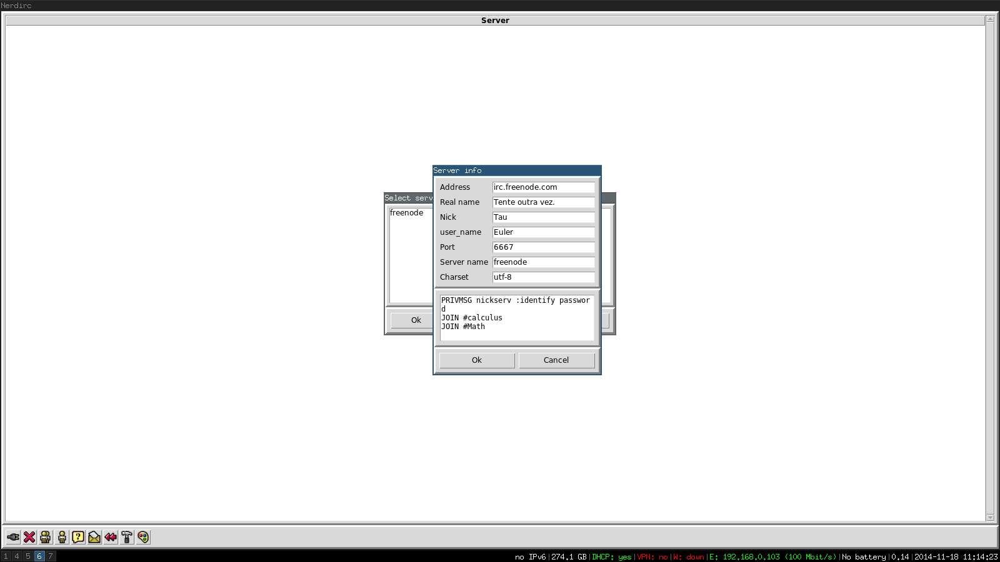
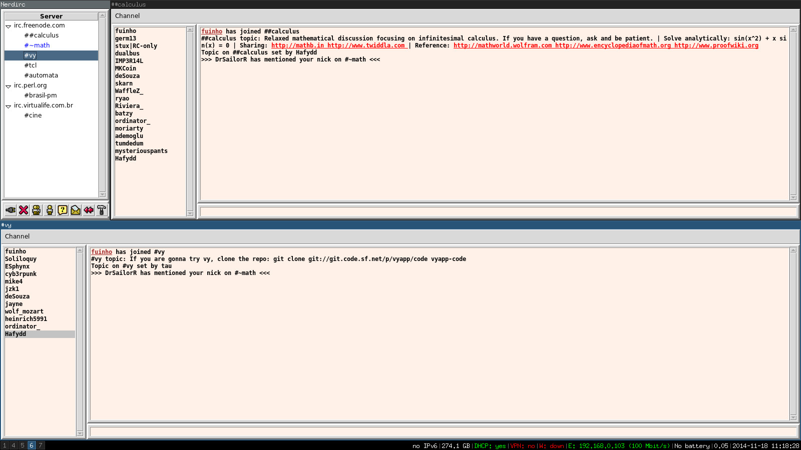
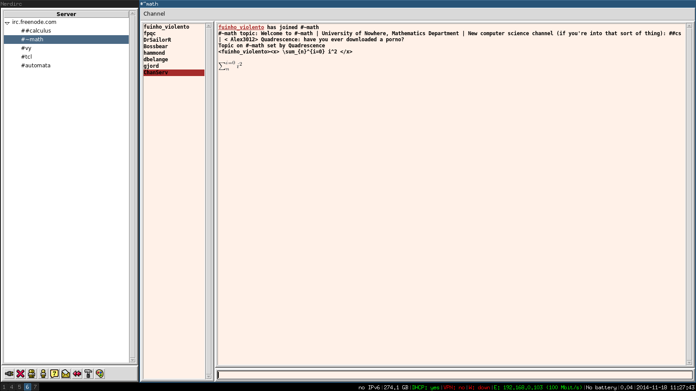

nerdirc
=======

Nerdirc is an IRC Client written in python with a powerful plugin interface. You can extend its functionalities with python plugins.

Install
=======

#### Dependencies

    python3
    texlive

#### Install from pip

    pip install nerdirc
    
Screenshot
==========

Plugins
=======

    nerdlib.stdmod 
    nerdlib.startup
    nerdlib.plugins.gossip.gossip 
    nerdlib.plugins.nickcall.nickcall 
    nerdlib.plugins.latex.latex
    nerdlib.plugins.highligh.highligh
    nerdlib.plugins.link.link
    nerdlib.plugins.ajoin.ajoin
    nerdlib.plugins.nickclick.nickclick
    

Plugin Example
==============

#### nerdlib/plugins/ajoin/ajoin.py

~~~python

def ukick(event, server, view):
    chan = event['channel'].lower()
    server.send_cmd('JOIN %s', chan)
        
~~~

That plugin is used to get back to the channel when you were kicked out.

#### Events

~~~python
{
    "chmsg":["^:(?P<nicka>.*?)!(?P<user>.*?)@(?P<host>.*?) PRIVMSG (?P<channel>[#].*?) :(?P<msg>.*?)\r\n$",0],
    "dccsend":["^:(?P<nicka>.*)!.* PRIVMSG .* :\\001DCC SEND (?P<file>.*?) (?P<ip>.*?) (?P<port>.*?) (?P<size>.*?)\\001\r\n$",0],
    "umsg":["^:(?P<nicka>.*?)!(?P<user>.*?)@(?P<host>.*?) PRIVMSG (?P<nickb>[^#].*?) :(?P<msg>.*?)\r\n", 0],
    "ping":["PING :(?P<server>.*?)\r\n", 0],
    "chnick":["^:(?P<nicka>.*?)!(?P<user>.*?)@(?P<host>.*?) NICK :(?P<nickb>.*?)\r\n", 0],
    "ukick":["^:(?P<nicka>.*?)!(?P<user>.*?)@(?P<host>.*?) KICK (?P<channel>.*?) (?P<nickb>.*?) :(?P<msg>.*?)\r\n", 0],
    "uban":["^:(?P<nicka>.*?)!(?P<user>.*?)@(?P<host>.*?) MODE (?P<channel>.*?) \\+b (?P<nickb>.*?)\r\n", 0],
    "upart":["^:(?P<nicka>.*?)!(?P<user>.*?)@(?P<host>.*?) PART :?(?P<channel>.*?)(?: :(?P<msg>.*))?\r\n", 0],
    "uop":["^:(?P<nicka>.*?)!(?P<user>.*?)@(?P<host>.*?) MODE (?P<channel>.*?) \\+o (?P<nickb>.*?)\r\n", 0],
	"uvoice":["^:(?P<nicka>.*?)!(?P<user>.*?)@(?P<host>.*?) MODE (?P<channel>.*?) \\+v (?P<nickb>.*?)\r\n", 0],
	"udevoice":["^:(?P<nicka>.*?)!(?P<user>.*?)@(?P<host>.*?) MODE (?P<channel>.*?) -v (?P<nickb>.*?)\r\n", 0],
    "udeop":["^:(?P<nicka>.*?)!(?P<user>.*?)@(?P<host>.*?) MODE (?P<channel>.*?) -o (?P<nickb>.*?)\r\n", 0],
    "ujoin":["^:(?P<nicka>.*?)!(?P<user>.*?)@(?P<host>.*?) JOIN :?(?P<channel>.*?)\r\n", 0],
    "umode":["^:(?P<nicka>.*?)!(?P<user>.*?)@(?P<host>.*?) MODE (?P<channel>.*?) (?P<mode>.*) (?P<nickb>.*?)\r\n", 0],
    "uquit":["^:(?P<nicka>.*?)!(?P<user>.*?)@(?P<host>.*?) QUIT (?P<msg>.*)\r\n", 0],
    "uerror":["^ERROR :(?P<msg>.*?)\r\n", 0],
    "ugroup":["(?P<server>.*?) 353 (?P<nick>.*?) (?P<mode>.) (?P<channel>.*?) :(?P<group>.*?)\r\n", 0],
    "ueon":["(?P<server>.*?) 366 (?P<nicka>.*?) (?P<channel>.*?) :End of /NAMES list.\r\n", 0],
     "motd":["(?P<server>.*?) 376 (?P<nicka>.*?) :(?P<msg>.*?)\r\n", 0],
     "userhost":["(?P<server>.*?) 302 (?P<nicka>.*?) :.+@(?P<myaddr>.*?)\r\n", 0],
	"lchmsg":["PRIVMSG (?P<target>[#]+.*?) :(?P<msg>.*)\r\n", 0],
	"lumsg":["PRIVMSG (?P<target>[^#].*?) :(?P<msg>.*)\r\n", 0],
	"userv":[":(?P<data>.*)\r\n", 0],
	"utopic":["(?P<server>.*?) 332 (?P<nicka>.*?) (?P<channel>.*?) :(?P<topic>.*)\r\n", 0],
	"utsb":["(?P<server>.*?) 333 (?P<nicka>.*?) (?P<channel>.*?) (?P<nickb>.*?) (?P<code>.*)\r\n", 0],
	"uusn":["^:(?P<service>.*?) NOTICE (?P<nicka>[^*#].*?) :(?P<msg>.*)\r\n", 0],
	"uchn":["^:(?P<service>.*?) NOTICE (?P<channel>#+.*?) :(?P<msg>.*)\r\n", 0],
	"lquit":["quit ?:?(?P<msg>.*)\r\n", 0],
	"llost":["^$", 0],
	"usync":["^SYNCHRONIZED$", 0],
	"ufailed":["^FAILED$", 0]
}

~~~

Irc messages are turned into events when parsed by nerdirc core. In order to get a handle called
when a message is sent over one of the channels that you are in.

~~~python
def chmsg(event, server, view):
    event['nicka']
    event['user']
    event['channel']
    ...
~~~

After implementing the handles, load the plugin through the GUI interface.
It is needed to have the python folder of the plugin appended to the python path.

